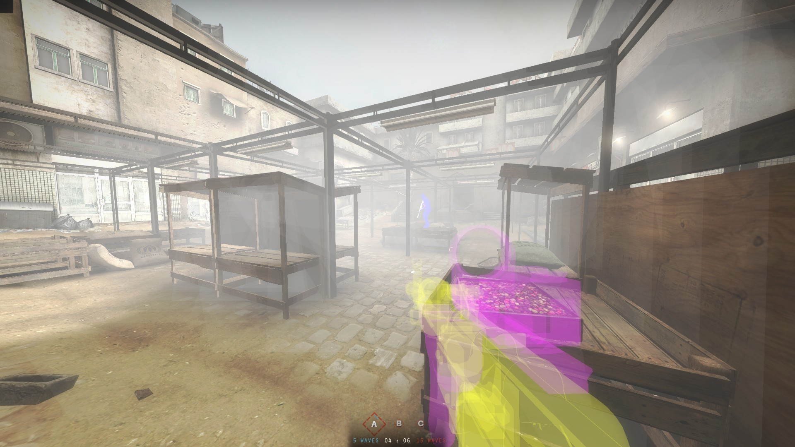

## InsMatPack
Pack of hack VMT materials for Insugency game.  
  
Education Purposes Only!    
Inspired by [insurgencycheat](https://github.com/jpeq/insurgencycheat)

### Description
This pack is just set of some materials that help's you to take advantage in the game.  
It's not detectable by VAC, because it uses engine's ability to custom VPK.  
Pack working only on the servers where a custom addons is allowed!  
  
<p align="center">
  
</p>

### Feathures
 - Colored Players
 - Colored Weapons/Attachments
 - NoFlash
 - NoSmoke
 - NoHands

### Installation
If you want, you can to pack this materials manually.  
For example, with [RVPK](https://github.com/panzi/rust-vpk).
```sh
$ mkdir topack
$ cp -r materials topack
$ rvpk pack mpack_dir.vpk topack
```
Otherwise, you can to download packed verison from [releases](https://github.com/0Magenta0/InsMatPack/releases).  
After that, you need to move this VPK file to `steamapps/common/insurgency2/insurgency/custom`.  
If you don't have a `custom` directory, just create it.

### License
This project uses GPLv3 License.  
Copyright 2022 0Magenta0

